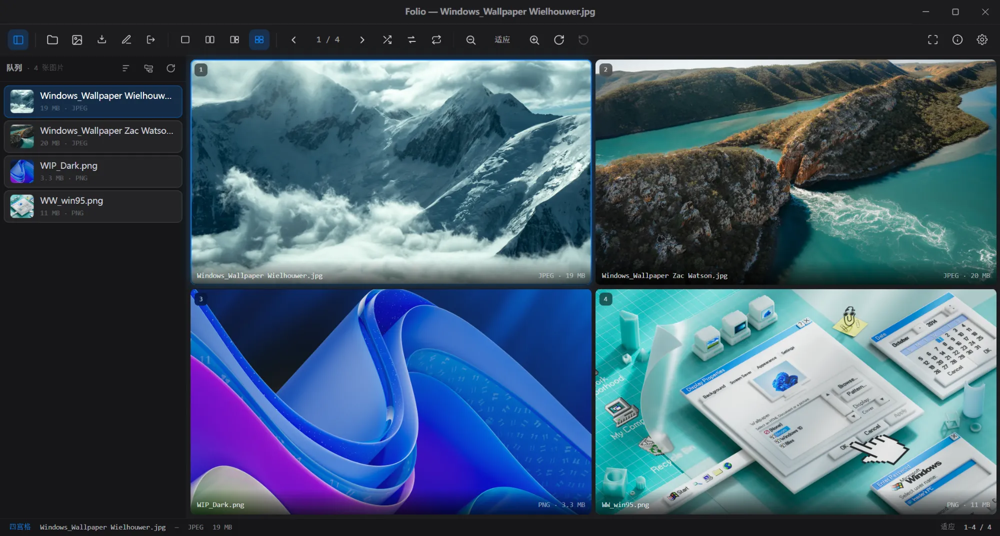

# Folio

简体中文 | [English](README_en.md)

Folio 是一款为「快速浏览成套相册」打造的跨平台桌面看图应用。基于频繁需要批量重命名、擦除 Exif 信息、保存图片至特定文件夹需求开发。 

项目采用 Electron + React + TypeScript 技术栈构建，由 Vibe Coding 驱动。

支持最多同时预览 4 张图片：



已实现功能见： [features.md](docs/features.md)

## 支持的图片格式

| 格式 | 浏览 | 说明 |
|---|---|---|
| JPEG · PNG · WebP · GIF · BMP · AVIF | ✅ 全平台 | 原生显示 |
| TIFF | ✅ 全平台 | 生成预览后显示 |
| SVG | ✅ 全平台 | 矢量渲染 |
| ICO | ✅ 全平台 | 仅显示(不作为格式转换输入) |
| HEIC · HEIF | ✅ macOS / ❌ Windows · Linux | macOS 经系统 ImageIO 显示 |
| JPEG XL（.jxl） | ✅ macOS / ❌ Windows · Linux | macOS 经系统 ImageIO 显示 |

> **Windows 与 Linux 暂不支持 HEIC 与 JPEG XL 的浏览**：当前运行时(Chromium / libvips)不内置这两种格式的解码器,macOS 借系统组件支持;Windows / Linux 的支持(随包解码器)在规划中。

## 开发

安装依赖：

```bash
pnpm install --frozen-lockfile

cd apps/desktop

npx install-electron
```

启动桌面应用：

```bash
pnpm dev
```

## Electron 安装说明

如果全新安装依赖后，运行 `pnpm dev` 报错：

```text
Error: Electron uninstall
```

是由于 Electron 42 [不再通过](https://www.electronjs.org/blog/electron-42-0#electron-no-longer-downloads-itself-via-postinstall-script) `postinstall` 下载自身。

需要手动执行：
```bash
npx install-electron
```

本应用的 Electron 依赖位于 `apps/desktop/package.json` 内，需要执行

```bash
cd apps/desktop
npx install-electron
```

然后重新启动应用：

```bash
pnpm dev
```

当前 workspace 已在 `pnpm-workspace.yaml` 中允许必要的安装脚本：

```yaml
allowBuilds:
  electron: true
  esbuild: true
```

## 常用命令

```bash
pnpm dev
pnpm build
pnpm typecheck
pnpm test
pnpm lint
pnpm format
```

## 打包

```bash
cd apps/desktop

# macOS 打包
pnpm dist:mac

# Windows 打包
pnpm dist:win
```

## License

本项目采用 GPL-3.0 许可证开放源代码。了解更多内容，请查看 [LICENSE 文件](LICENSE.txt)。

## 致谢

Folio 站在这些优秀开源项目的肩膀上,在此一并致谢:

- [Electron](https://www.electronjs.org/) — 跨平台桌面框架
- [React](https://react.dev/) — UI 框架
- [TypeScript](https://www.typescriptlang.org/) — 类型系统
- [Zustand](https://github.com/pmndrs/zustand) — 渲染进程状态管理
- [Tailwind CSS](https://tailwindcss.com/) — 样式
- [sharp](https://sharp.pixelplumbing.com/) / [libvips](https://www.libvips.org/) — 图片解码、缩略图与格式转换
- [ExifTool](https://exiftool.org/) / [exiftool-vendored](https://github.com/photostructure/exiftool-vendored.js) — Exif 元信息读取与擦除
- [better-sqlite3](https://github.com/WiseLibs/better-sqlite3) / [SQLite](https://www.sqlite.org/) — 本地缓存索引
- [Vite](https://vite.dev/) · [electron-vite](https://electron-vite.org/) · [electron-builder](https://www.electron.build/) — 构建与打包
- [Biome](https://biomejs.dev/) — 代码检查与格式化
- [Lucide](https://lucide.dev/) — 部分界面图标设计参考
